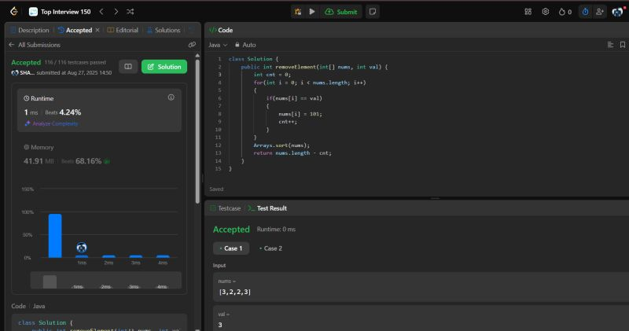

# Day 01 - Remove Element  

**Problem Link:** [Remove Element](https://leetcode.com/problems/remove-element/)  
**Difficulty:** Easy  

---

## 💡 Approach
- Use two pointers: one to iterate, one to track position of valid elements.
- Replace elements equal to `val`.
- Return new length of array.  

---

## ⏱️ Complexity
- Time: **O(n)**
- Space: **O(1)**  

---

## 📸 Screenshot

