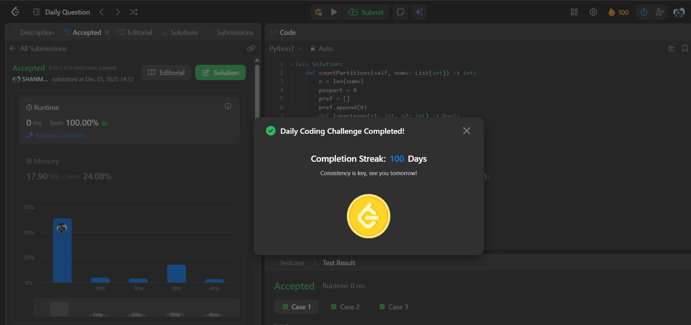

# Day 100 - Count Partitions with Even Sum Difference

**Problem Link**: [LeetCode 3432 - Count Partitions with Even Sum Difference](https://leetcode.com/problems/count-partitions-with-even-sum-difference/)  

## Approach

We solve this with a **simple but powerful observation**:

> For a partition at index `i`, let:
> - `S1 = sum(nums[0..i])`
> - `S2 = sum(nums[i+1..n-1])`
>
> Then: `S1 - S2` is even **if and only if** `S1 + S2` is even  
> → Because `S1 - S2 = 2*S1 - total_sum`

So:  
`S1 - S2` is even ⇔ `S1` and `total_sum` have the **same parity** (both even or both odd)

### Key Insight:
> We just need to count how many **prefix sums** have the **same parity** as the **total sum**.

### Steps:
1. Compute prefix sum array `pref`
2. `total = pref[-1]`
3. For each `i` from `0` to `n-2`:
   - If `pref[i+1] % 2 == total % 2` → valid partition
4. Count such positions

### Example:
`nums = [1, 2, 3, 4]`
- `total = 10` → even
- `pref = [0,1,3,6,10]`
- Check:
  - i=0 → `pref[1]=1` (odd) → no
  - i=1 → `pref[2]=3` (odd) → no
  - i=2 → `pref[3]=6` (even) → yes → count++
- Answer: **1**

### Complexity

- **Time**: **O(n)**
- **Space**: **O(n)** (for prefix array)

## Screenshot
