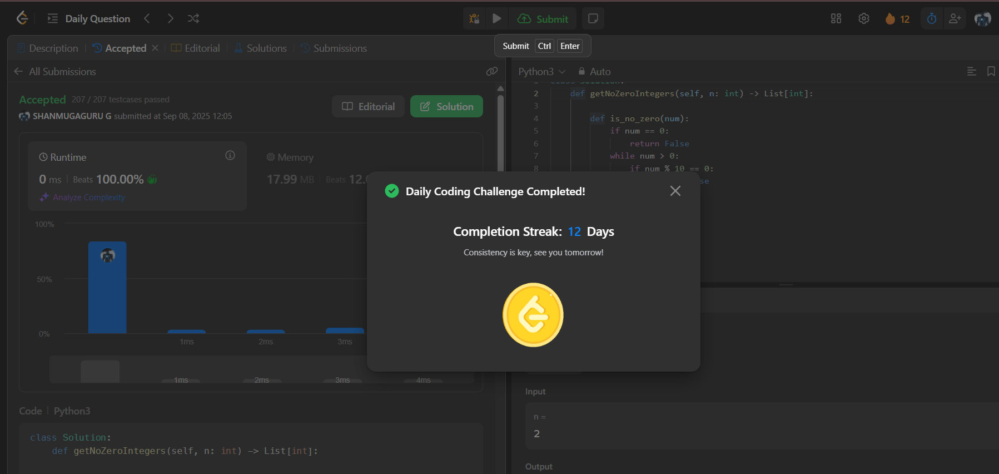

# Day 12 - Convert Integer to the Sum of Two No-Zero Integers

**Problem Link**: [LeetCode 1317 - Convert Integer to the Sum of Two No-Zero Integers](https://leetcode.com/problems/convert-integer-to-the-sum-of-two-no-zero-integers/)  
**Difficulty**: Easy  
**Status**: Solved

## 💡 Approach

The problem requires finding two positive integers `a` and `b` such that `a + b = n` and neither `a` nor `b` contains the digit `0` in their decimal representation.

- Define a helper function `is_no_zero(num)` that checks if a number contains no zero digits:
  - If the number is 0, return `False`.
  - While the number is greater than 0, check if the last digit is 0 using modulo 10. If it is, return `False`.
  - Divide the number by 10 (integer division) to remove the last digit.
  - If no zeros are found, return `True`.

- Iterate `a` from 1 to `n-1` (since `b = n - a` must be positive).
- For each `a`, calculate `b = n - a`.
- Check if both `a` and `b` contain no zero digits using the helper function.
- As soon as a valid pair is found, return `[a, b]`.
- The loop will always find a solution since such pairs exist for all `n ≥ 2`.

## ⏱️ Complexity

- **Time**: O(n * log(max(a, b))) - In the worst case, we iterate up to n, and for each iteration, the `is_no_zero` check takes O(log(num)) time to process the digits.
- **Space**: O(1) - Only constant extra space is used.

## 📸 Screenshot
