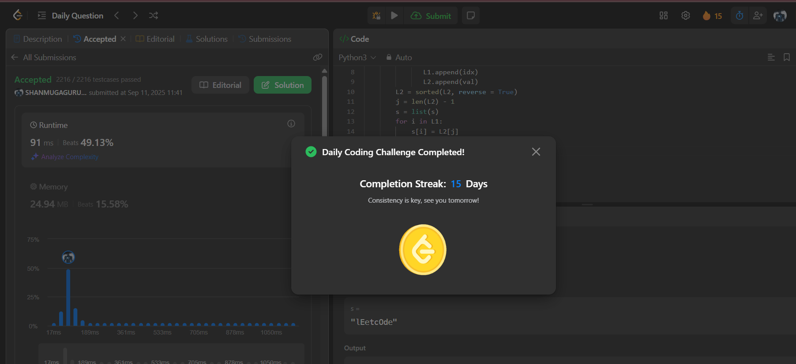

# Day 15 - Sort Vowels in a String

**Problem Link**: [LeetCode 2785 - Sort Vowels in a String](https://leetcode.com/problems/sort-vowels-in-a-string/)  
**Difficulty**: Medium

## 💡 Approach

We solve this by extracting, sorting, and replacing vowels in the string while preserving non-vowel positions.

- Define a list of vowels (`a, e, i, o, u, A, E, I, O, U`).
- Iterate through the string to collect:
  - Indices of vowels in `L1`.
  - Vowel characters in `L2`.
- Sort `L2` in descending order (to use pop for ascending order replacement).
- Convert the string to a list for modification.
- Replace vowels at indices in `L1` with sorted vowels from `L2` (popping from the end).
- Join the modified list back into a string and return.

## ⏱️ Complexity

- **Time**: O(n log n) - Iterating through the string is O(n), sorting vowels is O(k log k) where k ≤ n is the number of vowels, and joining is O(n).
- **Space**: O(n) - Space for lists `L1`, `L2`, and the string list, all bounded by the string length n.

## 📸 Screenshot
