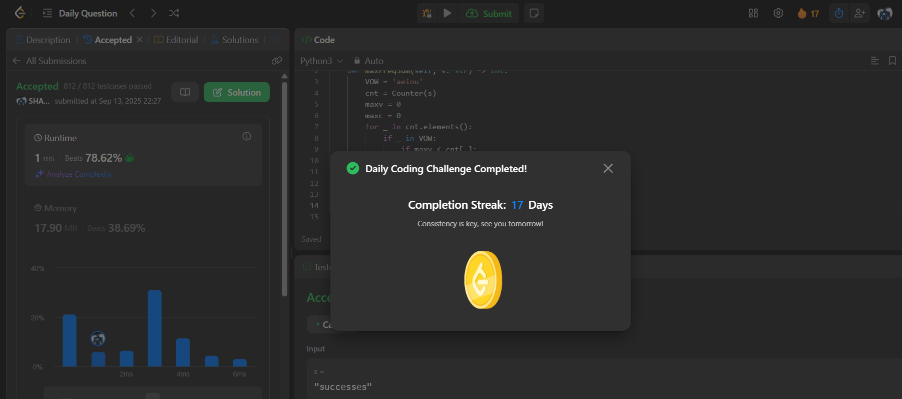

# Day 17 - Find Most Frequent Vowel and Consonant

**Problem Link**: [LeetCode 3541 - Find Most Frequent Vowel and Consonant](https://leetcode.com/problems/find-most-frequent-vowel-and-consonant/)  
**Difficulty**: Easy

## 💡 Approach

We solve this by counting the frequency of each character and finding the maximum frequency of a vowel and a consonant.

- Define a string of vowels (`aeiou`).
- Use a `Counter` to count the frequency of each character in the input string `s`.
- Iterate through the characters in the `Counter`:
  - If the character is a vowel, update `maxv` (maximum vowel frequency) if the current frequency is higher.
  - If the character is not a vowel, update `maxc` (maximum consonant frequency) if the current frequency is higher.
- Return the sum of `maxv` and `maxc`.

## ⏱️ Complexity

- **Time**: O(n) - Counting characters is O(n), where n is the string length, and iterating through the Counter is O(k) where k is the number of unique characters (k ≤ n).
- **Space**: O(k) - Space for the Counter, where k is the number of unique characters.

## 📸 Screenshot
