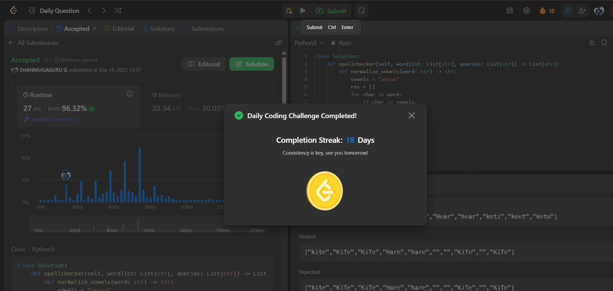

# Day 18 - Vowel Spellchecker

**Problem Link**: [LeetCode 966 - Vowel Spellchecker](https://leetcode.com/problems/vowel-spellchecker/)  
**Difficulty**: Medium

## 💡 Approach

We solve this using hash maps to handle three types of matches: exact, case-insensitive, and vowel-insensitive.

- Define a helper function `normalize_vowels` to replace vowels with '*' for vowel-insensitive matching.
- Create three data structures:
  - `word_set`: A set of original words for exact matches.
  - `case_insensitive_map`: A map of lowercase words to their first occurrence in `wordlist`.
  - `vowel_error_map`: A map of vowel-normalized lowercase words to their first occurrence in `wordlist`.
- For each query:
  - Check for an exact match in `word_set`.
  - If no exact match, check for a case-insensitive match using `case_insensitive_map`.
  - If no case-insensitive match, check for a vowel-insensitive match using `vowel_error_map`.
  - If no match is found, append an empty string.
- Return the list of results.

## ⏱️ Complexity

- **Time**: O(n + m) - Building the hash maps takes O(n) where n is the length of `wordlist`, and processing queries takes O(m) where m is the length of `queries`.
- **Space**: O(n) - Space for the set and hash maps storing words from `wordlist`.

## 📸 Screenshot
