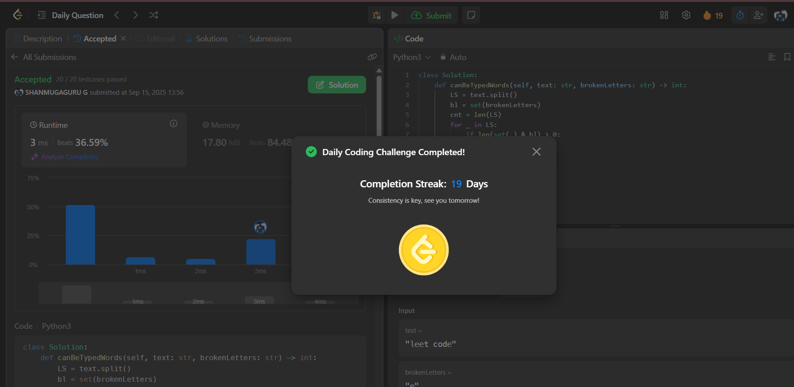

# Day 19 - Maximum Number of Words You Can Type

**Problem Link**: [LeetCode 1935 - Maximum Number of Words You Can Type](https://leetcode.com/problems/maximum-number-of-words-you-can-type/)  
**Difficulty**: Easy

## 💡 Approach

We solve this by checking each word in the text against a set of broken letters to count typable words.

- Split the input `text` into a list of words using `split()`.
- Convert `brokenLetters` into a set for O(1) lookup.
- Iterate through each word in the list:
  - For each letter in the word, check if it exists in the `brokenLetters` set.
  - If any letter is broken, increment a counter (`cnt`) and break (move to the next word).
- Return the total number of words (`len(LS)`) minus the number of untypable words (`cnt`).

## ⏱️ Complexity

- **Time**: O(n) - Where n is the total number of characters in `text` (splitting and iterating through words and letters).
- **Space**: O(k) - Where k is the length of `brokenLetters` for the set.

## 📸 Screenshot
