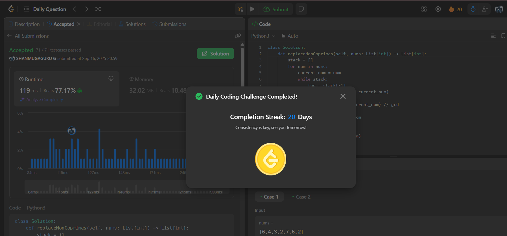

# Day 20 - Replace Non-Coprime Numbers in Array

**Problem Link**: [LeetCode 2197 - Replace Non-Coprime Numbers in Array](https://leetcode.com/problems/replace-non-coprime-numbers-in-array/)  
**Difficulty**: Hard

## 💡 Approach

We solve this using a stack to iteratively replace adjacent non-coprime numbers with their LCM.

- Initialize an empty stack to store numbers.
- For each number `num` in `nums`:
  - Set `current_num = num`.
  - While the stack is not empty:
    - Get the top number from the stack.
    - Compute the GCD of the top number and `current_num` using `math.gcd`.
    - If GCD > 1 (non-coprime), pop the top number and set `current_num` to their LCM (computed as `(top * current_num) // gcd`).
    - If GCD = 1 (coprime), break the loop.
  - Append `current_num` to the stack.
- Return the stack as the final array.

## ⏱️ Complexity

- **Time**: O(n * log M) - Where n is the length of `nums` and M is the maximum number in the array. Each GCD operation is O(log M), and we process each number at most once with potential stack operations.
- **Space**: O(n) - Space for the stack to store up to n numbers.

## 📸 Screenshot
