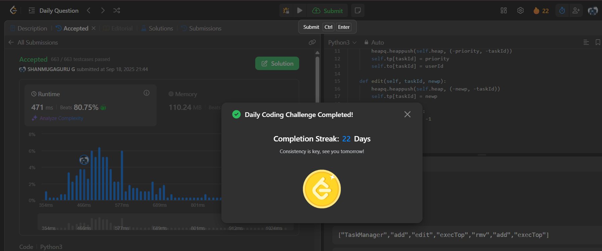

# Day 22 - Design Task Manager

**Problem Link**: [LeetCode 3408 - Design Task Manager](https://leetcode.com/problems/design-task-manager/)  
**Difficulty**: Medium

## 💡 Approach

We solve this using a max-heap (priority queue) with lazy deletion to manage tasks based on priority and task ID.

- **Initialization**:
  - Use a max-heap (`heap`) to store tasks as `(-priority, -taskId)` tuples (negative for Python's min-heap).
  - Use `tp` dict to map task IDs to their current priority.
  - Use `to` dict to map task IDs to their user IDs.
  - Add all initial tasks using the `add` method.
- **add**: Push `(-priority, -taskId)` to the heap and update `tp` and `to` mappings.
- **edit**: Push new `(-newPriority, -taskId)` to the heap and update `tp[taskId]` (lazy update).
- **rmv**: Mark task as removed by setting `tp[taskId] = -1` (lazy deletion).
- **execTop**:
  - Pop tasks from the heap until a valid task is found (where `tp[tid] == priority`).
  - Mark the task as executed by setting `tp[tid] = -1` and return the user ID from `to`.
  - If no valid task exists, return -1.
- Lazy deletion ensures efficient operations by marking invalid entries instead of removing them from the heap.

## ⏱️ Complexity

- **Time**:
  - `__init__`: O(n log n) - Adding n tasks to the heap.
  - `add`: O(log n) - Single heap push.
  - `edit`: O(log n) - Single heap push.
  - `rmv`: O(1) - Dictionary update.
  - `execTop`: Amortized O(log n) - Pops are bounded by total operations.
- **Space**: O(n) - For the heap and dictionaries storing n tasks.

## 📸 Screenshot
