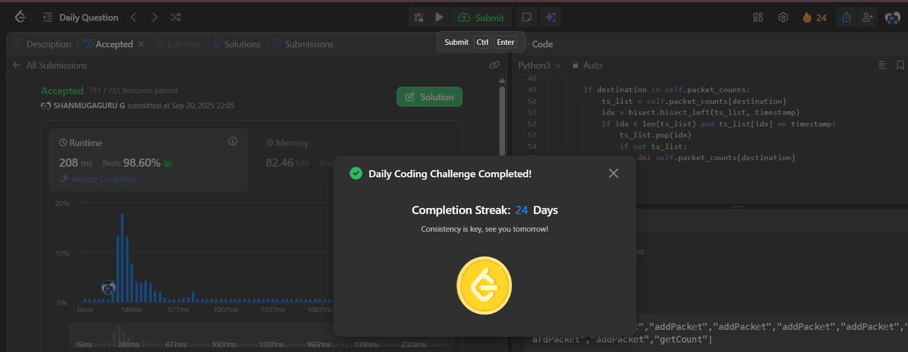

# Day 24 - Implement Router

**Problem Link**: [LeetCode 3508 - Implement Router](https://leetcode.com/problems/implement-router/)  
**Difficulty**: Medium

## 💡 Approach

We solve this using a deque, set, and sorted lists with binary search to manage packets within a memory limit.

- **Initialization**: 
  - Store `memoryLimit` and initialize:
    - `packet_queue` (deque) to track packets in order.
    - `packet_set` to check for duplicates.
    - `packet_counts` (dict) mapping destinations to sorted lists of timestamps.
- **addPacket**: 
  - Check if packet `(source, destination, timestamp)` exists in `packet_set`; if so, return `False`.
  - If queue is at `memoryLimit`, remove oldest packet from queue and set, and update `packet_counts`.
  - Add packet to queue and set, insert timestamp into `packet_counts[destination]` using binary search (`bisect.insort`).
  - Return `True`.
- **forwardPacket**: 
  - If queue is empty, return `[]`.
  - Pop oldest packet from queue, remove from set, update `packet_counts` by removing its timestamp.
  - Return packet as a list.
- **getCount**: 
  - For a given `destination`, use binary search (`bisect_left` and `bisect_right`) to count timestamps in `[startTime, endTime]` in `packet_counts[destination]`.
  - Return count or 0 if destination not found.

## ⏱️ Complexity

- **Time**:
  - `__init__`: O(n log n) - Adding n packets.
  - `addPacket`: O(log m) - Binary search for insertion, where m is timestamps per destination.
  - `forwardPacket`: O(log m) - Binary search for removal.
  - `getCount`: O(log m) - Binary search for range query.
- **Space**: O(n) - For deque, set, and sorted lists storing n packets.

## 📸 Screenshot
