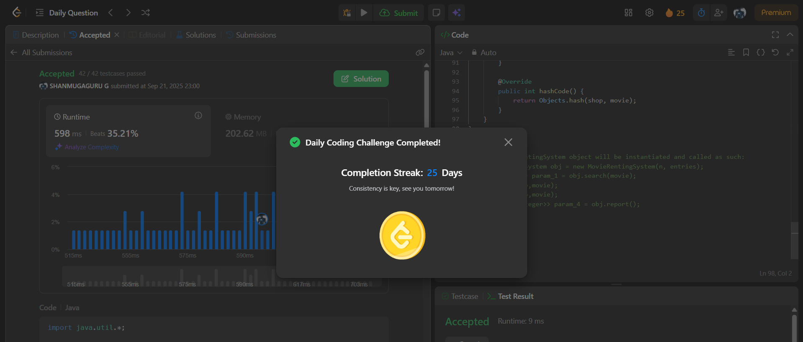

# Day 25 - Design Movie Rental System

**Problem Link**: [LeetCode 1912 - Design Movie Rental System](https://leetcode.com/problems/design-movie-rental-system/)  
**Difficulty**: Hard

## 💡 Approach

We solve this using sorted sets and hash maps to efficiently manage movie rentals across shops.

- **Initialization**:
  - Use `prices` (HashMap) to store (shop, movie) to price mappings.
  - Use `unrented` (HashMap of movie to TreeSet) to store available movies by price and shop ID.
  - Use `rented` (TreeSet) to store rented movies sorted by price, shop, and movie ID.
  - For each entry, populate `prices` and add (price, shop) to `unrented[movie]`.
- **search**: Return up to 5 shop IDs from `unrented[movie]` sorted by price and shop ID.
- **rent**: Remove (price, shop) from `unrented[movie]` and add (price, shop, movie) to `rented`.
- **drop**: Remove (price, shop, movie) from `rented` and add (price, shop) back to `unrented[movie]`.
- **report**: Return up to 5 (shop, movie) pairs from `rented` sorted by price, shop, and movie ID.
- Use a custom `ShopMovieKey` class for (shop, movie) key in `prices`.

## ⏱️ Complexity

- **Time**:
  - `__init__`: O(n log n) - Processing n entries with TreeSet insertions.
  - `search`: O(log m + k) - TreeSet navigation (m = movies in shop, k ≤ 5).
  - `rent`: O(log m) - TreeSet remove/add.
  - `drop`: O(log m) - TreeSet remove/add.
  - `report`: O(log m + k) - TreeSet iteration (k ≤ 5).
- **Space**: O(n) - Storage for HashMap and TreeSets.

## 📸 Screenshot
