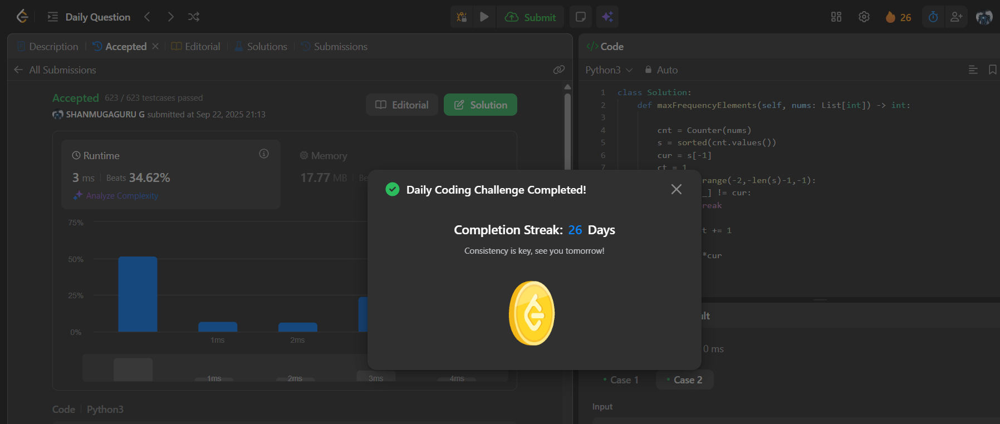

# Day 26 - Count Elements With Maximum Frequency

**Problem Link**: [LeetCode 3005 - Count Elements With Maximum Frequency](https://leetcode.com/problems/count-elements-with-maximum-frequency/)  
**Difficulty**: Easy

## 💡 Approach

We solve this by counting element frequencies and summing the frequencies of elements with the maximum frequency.

- Use a `Counter` to count the frequency of each element in `nums`.
- Sort the frequency values in ascending order.
- Take the highest frequency (`cur = s[-1]`).
- Initialize a counter (`ct = 1`) for the last frequency.
- Iterate backward through the sorted frequencies until a different frequency is found, incrementing `ct` for each matching frequency.
- Return the product of the maximum frequency (`cur`) and the count of elements with that frequency (`ct`).

## ⏱️ Complexity

- **Time**: O(n log n) - Building the Counter is O(n), sorting frequencies is O(k log k) where k ≤ n is the number of unique elements.
- **Space**: O(n) - Space for the Counter and sorted frequency list.

## 📸 Screenshot
