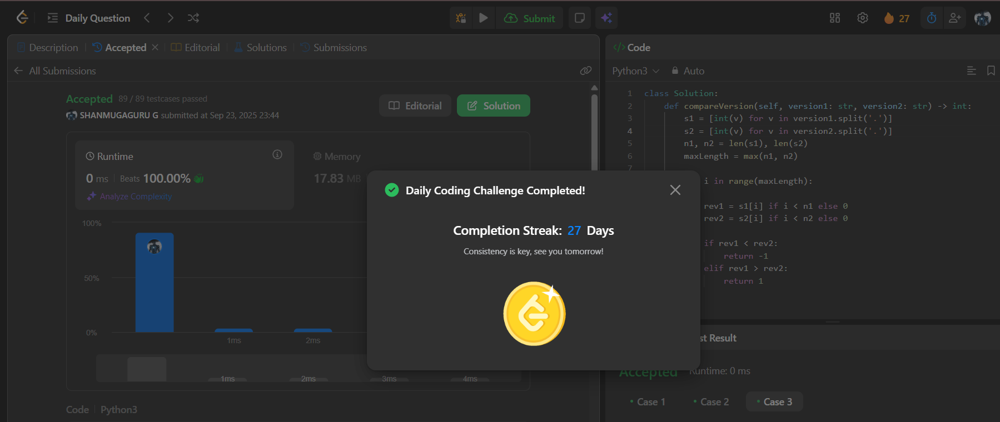

# Day 27 - Compare Version Numbers

**Problem Link**: [LeetCode 165 - Compare Version Numbers](https://leetcode.com/problems/compare-version-numbers/)  
**Difficulty**: Medium

## 💡 Approach

We solve this by splitting version strings into revision numbers and comparing them position-wise.

- Split `version1` and `version2` into lists of integers using the '.' delimiter.
- Get lengths `n1` and `n2` of the resulting lists and find the maximum length.
- Iterate through the maximum length:
  - For each position, use the revision number if it exists; otherwise, use 0.
  - Compare revisions `rev1` (from `version1`) and `rev2` (from `version2`):
    - If `rev1 < rev2`, return -1.
    - If `rev1 > rev2`, return 1.
- If all revisions match, return 0.

## ⏱️ Complexity

- **Time**: O(n) - Where n is the maximum number of revisions (length of longer version string), including splitting and comparison.
- **Space**: O(n) - Space for storing the split revision lists.

## 📸 Screenshot
