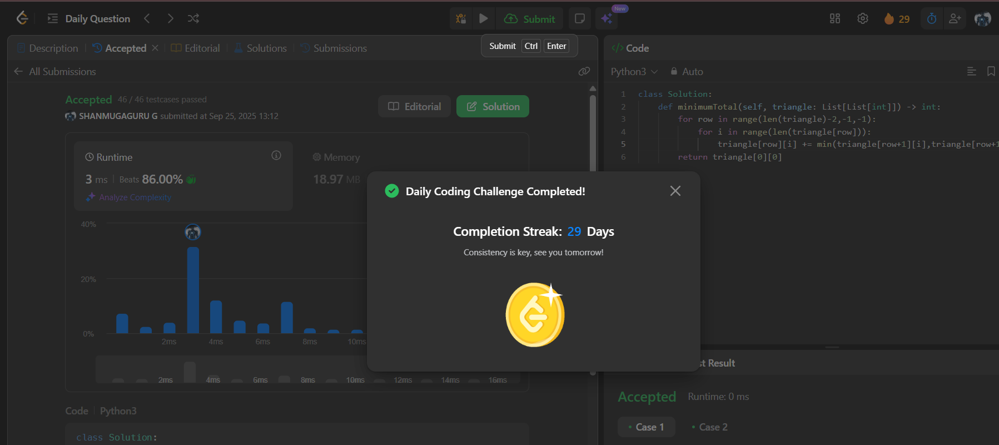

# Day 29 - Triangle

**Problem Link**: [LeetCode 120 - Triangle](https://leetcode.com/problems/triangle/)  
**Difficulty**: Medium

## 💡 Approach

We solve this using bottom-up dynamic programming to find the minimum path sum from the top to the bottom of the triangle.

- Start from the second-to-last row and move upward to the top.
- For each element in the current row, add the minimum of the two possible values from the row below (directly below or diagonally right).
- Update the current element with this sum, effectively storing the minimum path sum to reach that position.
- After processing all rows, the top element (`triangle[0][0]`) contains the minimum path sum from top to bottom.

## ⏱️ Complexity

- **Time**: O(n) - Where n is the total number of elements in the triangle (sum of row lengths).
- **Space**: O(1) - Modify the input triangle in-place, using no extra space.

## 📸 Screenshot
