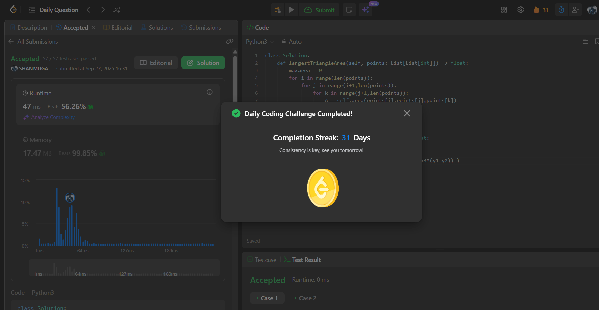

# Day 31 - Largest Triangle Area

**Problem Link**: [LeetCode 812 - Largest Triangle Area](https://leetcode.com/problems/largest-triangle-area/)  
**Difficulty**: Easy

## 💡 Approach

We solve this by computing the area of all possible triangles formed by triplets of points and tracking the maximum area.

- Iterate through all unique triplets of points using three nested loops (`i`, `j`, `k`).
- For each triplet, calculate the area using the shoelace formula in the `area` helper function:
  - Given points `(x1, y1)`, `(x2, y2)`, `(x3, y3)`, compute area as `0.5 * |x1*(y2-y3) + x2*(y3-y1) + x3*(y1-y2)|`.
- Track the maximum area encountered across all triplets.
- Return the maximum area.

## ⏱️ Complexity

- **Time**: O(n³) - Where n is the number of points, due to three nested loops to check all triplets.
- **Space**: O(1) - Only constant extra space is used for variables.

## 📸 Screenshot
