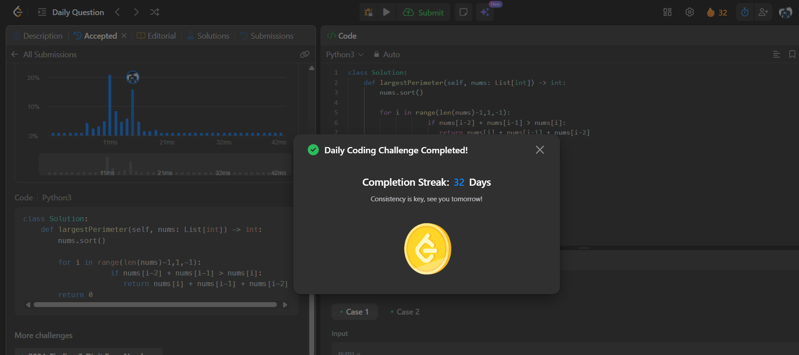

# Day 32 - Largest Perimeter Triangle

**Problem Link**: [LeetCode 976 - Largest Perimeter Triangle](https://leetcode.com/problems/largest-perimeter-triangle/)  
**Difficulty**: Easy

## 💡 Approach

We solve this by sorting the array and checking triplets from largest to smallest to find the first valid triangle perimeter.

- Sort the input array `nums` in ascending order.
- Iterate from the end of the array (index `len(nums)-1` to 2) to consider the largest possible sides first.
- For each index `i`, check if `nums[i-2] + nums[i-1] > nums[i]` (triangle inequality).
- If satisfied, return the perimeter `nums[i] + nums[i-1] + nums[i-2]`.
- If no valid triangle is found, return 0.

## ⏱️ Complexity

- **Time**: O(n log n) - Sorting takes O(n log n), and the single pass through the array is O(n), where n is the length of `nums`.
- **Space**: O(1) - No extra space beyond input storage (assuming in-place sorting).

## 📸 Screenshot
