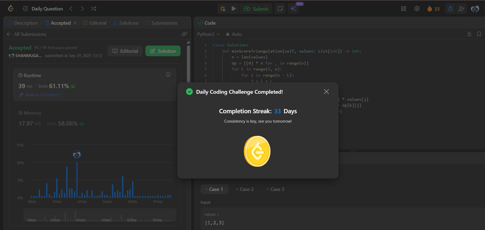

# Day 33 - Minimum Score Triangulation of Polygon

**Problem Link**: [LeetCode 1039 - Minimum Score Triangulation of Polygon](https://leetcode.com/problems/minimum-score-triangulation-of-polygon/)  
**Difficulty**: Medium

## 💡 Approach

We solve this using dynamic programming to find the minimum score for triangulating a convex polygon.

- Create a DP table `dp` where `dp[i][j]` represents the minimum score for triangulating the sub-polygon from vertex `i` to `j`.
- Iterate over sub-polygon lengths `L` from 2 to `n-1` (since a triangle needs at least 3 vertices).
- For each length `L`, iterate over starting index `i` and compute ending index `j = i + L`.
- For each sub-polygon `i` to `j`, try every vertex `k` between `i` and `j` to form a triangle `(i, k, j)`:
  - Compute the triangle's weight as `values[i] * values[k] * values[j]`.
  - The score for this triangulation is the triangle's weight plus the scores of the two sub-polygons (`dp[i][k] + dp[k][j]`).
  - Update `dp[i][j]` with the minimum score.
- Return `dp[0][n-1]`, the minimum score for the entire polygon.

## ⏱️ Complexity

- **Time**: O(n³) - Three nested loops: length `L`, start index `i`, and middle vertex `k`.
- **Space**: O(n²) - For the DP table of size n x n.

## 📸 Screenshot
