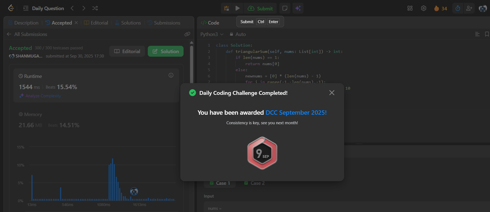

# Day 34 - Find Triangular Sum of an Array

**Problem Link**: [LeetCode 2221 - Find Triangular Sum of an Array](https://leetcode.com/problems/find-triangular-sum-of-an-array/)  
**Difficulty**: Medium

## 💡 Approach

We solve this using a recursive approach to compute the triangular sum by repeatedly reducing the array.

- If the array length is 1, return the single element.
- Otherwise, create a new array `newnums` of size `len(nums) - 1`.
- For each index `i` from -1 to -len(nums), compute `(nums[i] + nums[i-1]) % 10` and store in `newnums`.
- Recursively call `triangularSum` on `newnums` until a single element remains.
- Return the final element as the triangular sum.

## ⏱️ Complexity

- **Time**: O(n²) - Each recursive call reduces the array size by 1, and we perform O(n) operations per call, with n calls in total.
- **Space**: O(n) - Space for the new array in each recursive call, and the recursion stack depth is O(n).

## 📸 Screenshot
