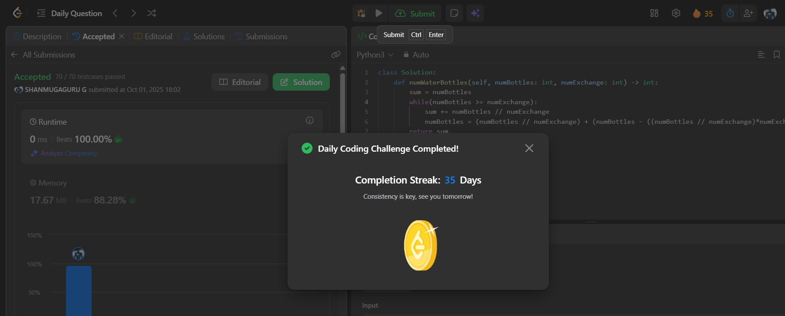

# Day 35 - Water Bottles

**Problem Link**: [LeetCode 1518 - Water Bottles](https://leetcode.com/problems/water-bottles/)  
**Difficulty**: Easy

## 💡 Approach

We solve this by simulating the process of drinking and exchanging water bottles iteratively.

- Initialize `sum` with `numBottles` (initial bottles drunk).
- While `numBottles >= numExchange`:
  - Add the number of new bottles obtained by exchanging (`numBottles // numExchange`) to `sum`.
  - Update `numBottles` to include new bottles from exchange (`numBottles // numExchange`) plus remaining bottles (`numBottles % numExchange`).
- Return the total number of bottles drunk (`sum`).

## ⏱️ Complexity

- **Time**: O(log n) - Where n is `numBottles`, as each iteration reduces the number of bottles by at least a factor of `numExchange`.
- **Space**: O(1) - Only constant extra space is used.

## 📸 Screenshot
