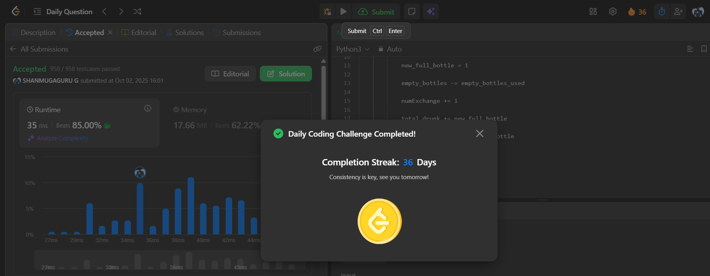

# Day 36 - Water Bottles II

**Problem Link**: [LeetCode 3100 - Water Bottles II](https://leetcode.com/problems/water-bottles-ii/)  
**Difficulty**: Medium

## 💡 Approach

We solve this by simulating the process of drinking water bottles and exchanging empty bottles, with an increasing exchange requirement.

- Initialize `total_drunk` and `empty_bottles` with `numBottles` (initial bottles drunk).
- While `empty_bottles >= numExchange`:
  - Use `numExchange` empty bottles to get 1 new full bottle.
  - Subtract `numExchange` from `empty_bottles`.
  - Increment `numExchange` by 1 (exchange requirement increases).
  - Add 1 to `total_drunk` for the new bottle drunk.
  - Add 1 to `empty_bottles` (the new bottle becomes empty after drinking).
- Return `total_drunk` as the total number of bottles drunk.

## ⏱️ Complexity

- **Time**: O(log n) - Where n is `numBottles`, as each iteration reduces empty bottles significantly, bounded by the increasing `numExchange`.
- **Space**: O(1) - Only constant extra space is used.

## 📸 Screenshot
