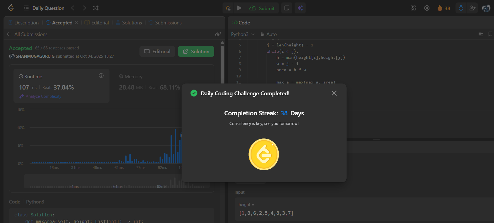

# Day 38 - Container With Most Water

**Problem Link**: [LeetCode 11 - Container With Most Water](https://leetcode.com/problems/container-with-most-water/)  
**Difficulty**: Medium

## 💡 Approach

We solve this using a two-pointer technique to maximize the area of water trapped between two lines.

- Initialize two pointers: `i` at the start (0) and `j` at the end (`len(height) - 1`).
- Initialize `max_a` to track the maximum area.
- While `i < j`:
  - Calculate the area as the minimum height between `height[i]` and `height[j]` multiplied by the distance (`j - i`).
  - Update `max_a` if the current area is larger.
  - Move the pointer corresponding to the smaller height inward (if `height[i] < height[j]`, increment `i`; else, decrement `j`).
- Return `max_a`.

## ⏱️ Complexity

- **Time**: O(n) - Single pass with two pointers, where n is the length of `height`.
- **Space**: O(1) - Only constant extra space is used.

## 📸 Screenshot
