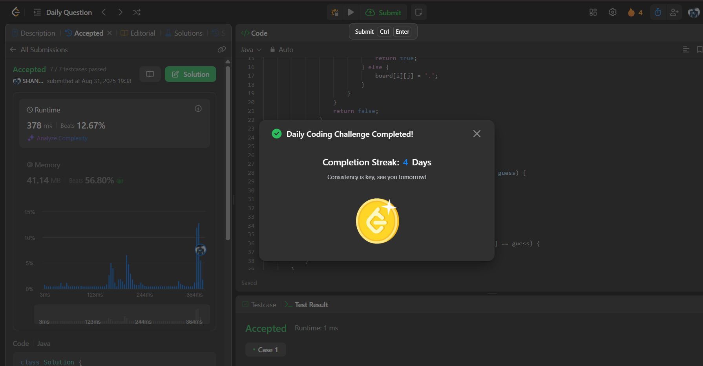

# 37. Sudoku Solver

**Link:** [LeetCode 37 – Sudoku Solver](https://leetcode.com/problems/sudoku-solver/)  
**Difficulty:** Hard  

---

## 📝 Problem Summary
You are given a partially filled `9 × 9` Sudoku board. The task is to fill the empty cells so that:  
- Each row contains digits `1–9` without repetition.  
- Each column contains digits `1–9` without repetition.  
- Each of the nine `3 × 3` sub-boxes contains digits `1–9` without repetition.  

Empty cells are denoted by `'.'`. You must modify the board **in-place** to produce a valid solution.  

---

## 💡 Intuition
Sudoku is a **constraint satisfaction problem**.  
We solve it using **backtracking**:  
- Try digits `1–9` in an empty cell.  
- If valid under Sudoku rules, place it and recurse.  
- If no digit works, backtrack to a previous step.  

---

## 🔧 Approach
- Iterate over the board until you find an empty cell (`.`).  
- For each candidate digit `1–9`:  
  - Check if the placement is valid in its row, column, and 3×3 sub-box.  
  - If valid, place it and move to the next cell recursively.  
  - If recursion fails, reset (backtrack) and try another digit.  
- Continue until all cells are filled.  

---

## ✅ Correctness
- Validity is checked at each step, ensuring constraints are never broken.  
- Backtracking explores all feasible placements, so a valid solution will always be found if it exists (guaranteed by the problem).  

---

## ⏱️ Complexity
- **Time Complexity:** Worst case exponential (`O(9^(81))`), but with pruning runs efficiently in practice.  
- **Space Complexity:** `O(1)` extra (board modified in place; recursion stack ≤ 81).  

---

## 🧪 Edge Cases
- Puzzle is already solved → returns immediately.  
- Nearly solved puzzle → minimal backtracking.  
- Hardest cases → deeper recursion, but still solvable.  

---

## 📸 Screenshot
Add your LeetCode submission screenshot here:  

---

## 📚 Notes / Learnings
- Backtracking is a powerful general approach for constraint problems.  
- Validity check must include **row, column, and sub-box** simultaneously.  
- Can be optimized using **hash sets / bitmasks** for faster validation.  
