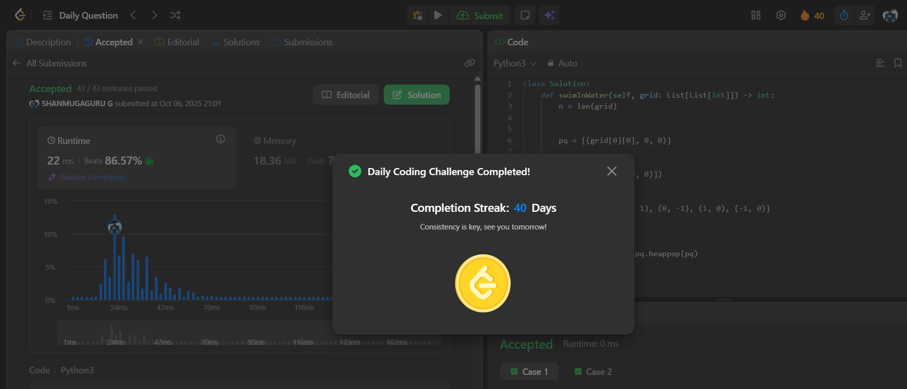

# Day 40 - Swim in Rising Water

**Problem Link**: [LeetCode 778 - Swim in Rising Water](https://leetcode.com/problems/swim-in-rising-water/)  
**Difficulty**: Hard

## 💡 Approach

We solve this using a priority queue (min-heap) to find the minimum time required to swim from top-left to bottom-right in a grid.

- Initialize a min-heap `pq` with the starting cell `(grid[0][0], 0, 0)` (time, row, col).
- Use a `visited` set to track explored cells, starting with `(0, 0)`.
- Define four directions (up, down, left, right) for movement.
- While the heap is not empty:
  - Pop the cell with the minimum time `t` at position `(r, c)`.
  - If the cell is the bottom-right `(n-1, n-1)`, return `t` as the minimum time.
  - For each valid, unvisited neighbor:
    - Compute the new time as `max(t, grid[nr][nc])` (maximum height encountered on the path).
    - Add the neighbor to `visited` and push `(new_time, nr, nc)` to the heap.
- Return -1 if no path is found (though the problem guarantees a path).

## ⏱️ Complexity

- **Time**: O(n² log n) - Where n is the grid size. Each cell is processed at most once, with heap operations costing O(log n).
- **Space**: O(n²) - For the visited set and priority queue.

## 📸 Screenshot
