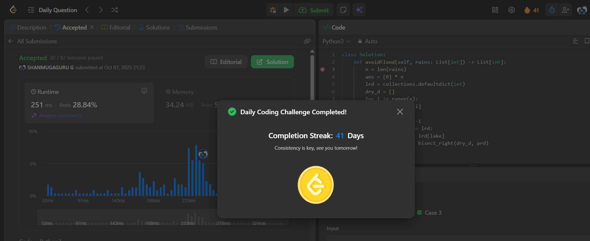

# Day 41 - Avoid Flood in The City

**Problem Link**: [LeetCode 1488 - Avoid Flood in The City](https://leetcode.com/problems/avoid-flood-in-the-city/)  
**Difficulty**: Medium

## 💡 Approach

We solve this using a greedy approach with a dictionary and sorted list to manage lake drying operations.

- Initialize an answer array `ans` of size n with zeros and a defaultdict `lrd` to track the last rain day for each lake.
- Use a list `dry_d` to store indices of dry days (when `rains[i] == 0`).
- Iterate through `rains`:
  - If `lake > 0` (rain day):
    - Set `ans[i] = -1` (cannot dry on rain day).
    - If the lake was previously rained on (`lake in lrd`):
      - Find the earliest dry day after the last rain day using binary search (`bisect_right`).
      - If a valid dry day exists, assign `ans[dry_day] = lake` and remove the dry day from `dry_d`.
      - If no valid dry day exists, return `[]` (impossible to avoid flood).
    - Update `lrd[lake] = i` with the current day.
  - If `lake == 0` (dry day):
    - Add the day index to `dry_d` and set `ans[i] = 0`.
- For remaining dry days in `dry_d`, set `ans[i] = 1` (arbitrary lake to dry).
- Return `ans`.

## ⏱️ Complexity

- **Time**: O(n log n) - Where n is the length of `rains`. Binary search (`bisect_right`) takes O(log n) for each lake, and we process n days.
- **Space**: O(n) - For the answer array, `lrd` dictionary, and `dry_d` list.

## 📸 Screenshot
