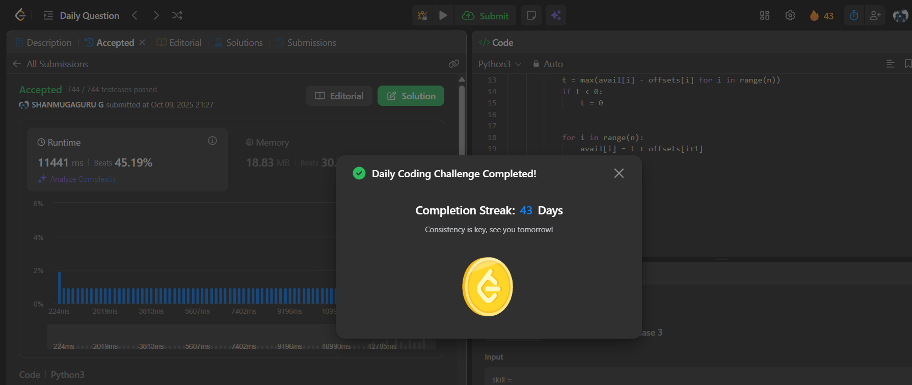

# Day 43 - Find the Minimum Amount of Time to Brew Potions

**Problem Link**: [LeetCode 3494 - Find the Minimum Amount of Time to Brew Potions](https://leetcode.com/problems/find-the-minimum-amount-of-time-to-brew-potions/)  
**Difficulty**: Medium

## 💡 Approach

We solve this using a prefix sum approach to calculate the minimum time to brew potions across wizards.

- Initialize an array `avail` of size `n` (number of wizards) to track the earliest time each wizard is available.
- For each potion `j` (with mana cost `mana[j]`):
  - Compute a prefix sum array `offsets` where `offsets[i+1] = offsets[i] + skill[i] * mana[j]` to represent cumulative brewing time up to wizard `i`.
  - Find the maximum `avail[i] - offsets[i]` across all wizards `i` to determine the earliest start time `t` for brewing the potion (use 0 if `t < 0`).
  - Update `avail[i] = t + offsets[i+1]` for each wizard to reflect the new availability after brewing.
- Return `avail[-1]`, the time when the last wizard completes brewing all potions.

## ⏱️ Complexity

- **Time**: O(m * n) - Where `m` is the number of potions and `n` is the number of wizards. We iterate through `n` wizards for each of `m` potions.
- **Space**: O(n) - For the `avail` and `offsets` arrays.

## 📸 Screenshot
