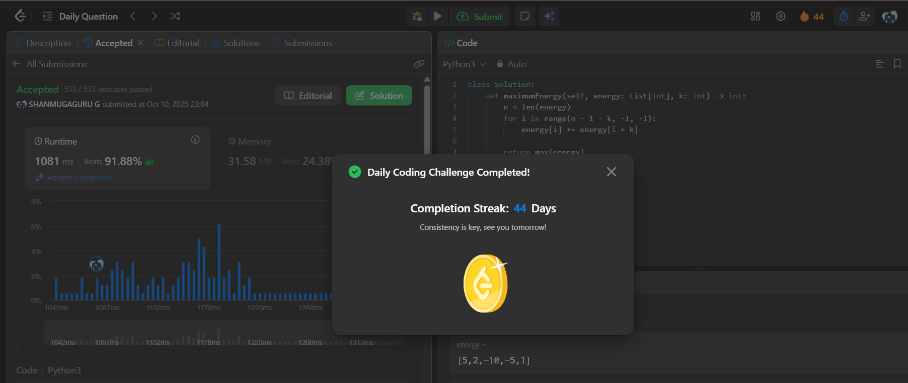

# Day 44 - Taking Maximum Energy From the Mystic Dungeon

**Problem Link**: [LeetCode 3147 - Taking Maximum Energy From the Mystic Dungeon](https://leetcode.com/problems/taking-maximum-energy-from-the-mystic-dungeon/)  
**Difficulty**: Medium

## 💡 Approach

We solve this by computing cumulative energy sums from each possible starting position using a single pass.

- Iterate backward from index `n-1-k` to 0, where `n` is the length of `energy` and `k` is the jump size.
- For each index `i`, add the energy at `i+k` to `energy[i]`, effectively accumulating the total energy for paths starting at `i`.
- Return the maximum value in the `energy` array, which represents the maximum energy achievable from any starting position.

## ⏱️ Complexity

- **Time**: O(n) - Single pass through the array for updates, followed by finding the maximum.
- **Space**: O(1) - Modify the input array in-place (excluding input storage).

## 📸 Screenshot
