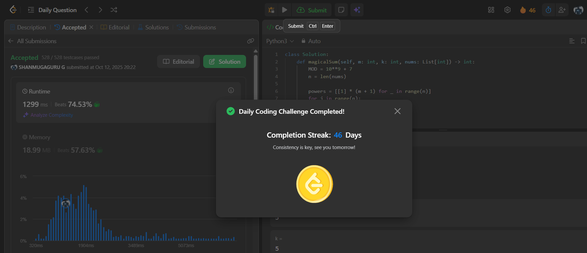

# Day 46 - Find Sum of Array Product of Magical Sequences

**Problem Link**: [LeetCode 3539 - Find Sum of Array Product of Magical Sequences](https://leetcode.com/problems/find-sum-of-array-product-of-magical-sequences/)  
**Difficulty**: Hard

## 💡 Approach

We solve this using dynamic programming with modular arithmetic to compute the sum of products of magical sequences.

- Precompute powers of each number in `nums` up to `m` modulo `10^9 + 7` for efficiency.
- Precompute factorials and inverse factorials for binomial coefficients using modular exponentiation.
- Define a DP state `dp[c][b][k]` representing the number of ways to use `c` elements, with `b` carry-over elements, and `k` bits in the final sum.
- For each number in `nums`:
  - Iterate over previous states (`c_old`, `b_old`, `k_old`).
  - For each possible count `c_j` of the current number:
    - Compute new state (`c_new`, `b_new`, `k_new`) based on total quantity (`c_j + b_old`), new carry (`quantity // 2`), and bit (`quantity % 2`).
    - Calculate contribution using the product (`powers[j][c_j]`) and binomial coefficient (`nCr(m - c_old, c_j)`).
    - Update the new state modulo `10^9 + 7`.
- After processing all numbers, handle remaining carry-overs with up to 6 extra steps to reduce `b` to 0.
- Return `dp[m][0][k]`, the sum of products for sequences with exactly `k` bits.

## ⏱️ Complexity

- **Time**: O(n * m² * k) - Where n is the length of `nums`, m is the max elements, and k is the target bits. Each DP transition iterates over O(m² * k) states.
- **Space**: O(m² * k) - For the DP table.

## 📸 Screenshot
