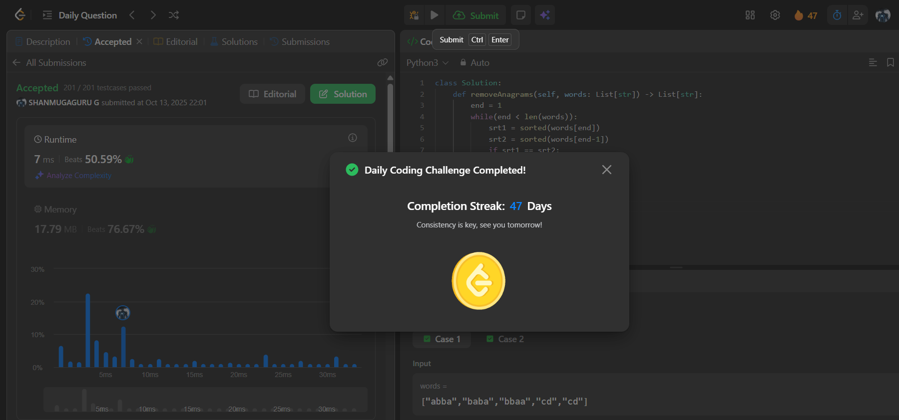

# Day 47 - Find Resultant Array After Removing Anagrams

**Problem Link**: [LeetCode 2273 - Find Resultant Array After Removing Anagrams](https://leetcode.com/problems/find-resultant-array-after-removing-anagrams/)  
**Difficulty**: Easy

## 💡 Approach

We solve this by iterating through the array and removing consecutive anagrams by comparing sorted characters.

- Initialize a pointer `end` starting at index 1.
- While `end` is within the array bounds:
  - Sort the characters of the current word (`words[end]`) and the previous word (`words[end-1]`).
  - If the sorted characters are equal (indicating anagrams), remove the current word (`words[end]`).
  - Otherwise, increment `end` to move to the next word.
- Return the modified `words` array with consecutive anagrams removed.

## ⏱️ Complexity

- **Time**: O(n * k * log k) - Where n is the length of `words` and k is the maximum length of a word. Sorting each word takes O(k log k), and we iterate through n words.
- **Space**: O(k) - For storing sorted character lists, excluding the output array.

## 📸 Screenshot
