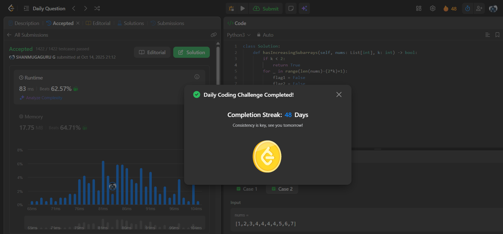

# Day 48 - Adjacent Increasing Subarrays Detection I

**Problem Link**: [LeetCode 3349 - Adjacent Increasing Subarrays Detection I](https://leetcode.com/problems/adjacent-increasing-subarrays-detection-i/)  
**Difficulty**: Medium

## 💡 Approach

We solve this by checking for two adjacent increasing subarrays of length `k` in the array.

- If `k < 2`, return `True` (trivial case).
- Iterate through possible starting positions for the first subarray (up to `len(nums) - 2k + 1` positions).
- For each starting position `start`:
  - Check the first subarray from `start` to `start + k - 1`:
    - Verify if all adjacent elements are strictly increasing (`nums[i] < nums[i+1]`).
    - Set `flag1 = True` if the entire subarray is increasing.
  - If `flag1` is `True`, check the second adjacent subarray from `start + k` to `start + 2k - 1`:
    - Verify if all adjacent elements are strictly increasing.
    - Set `flag2 = True` if the entire subarray is increasing.
  - If both `flag1` and `flag2` are `True`, return `True` (found adjacent increasing subarrays).
- If no such pair is found after checking all positions, return `False`.

## ⏱️ Complexity

- **Time**: O(n * k) - Where n is the length of `nums`. We check up to O(n) starting positions, each requiring O(k) comparisons for two subarrays.
- **Space**: O(1) - Only constant extra space is used.

## 📸 Screenshot
