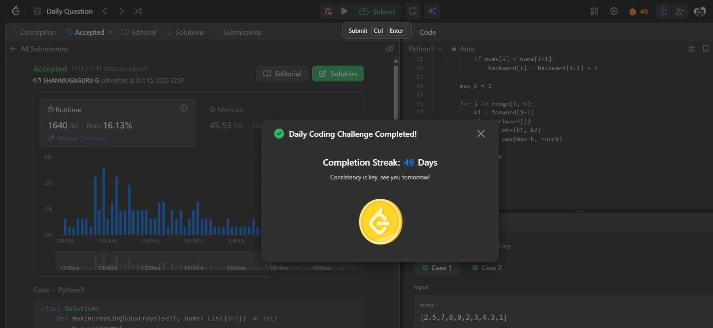

# Day 49 - Adjacent Increasing Subarrays Detection II

**Problem Link**: [LeetCode 3350 - Adjacent Increasing Subarrays Detection II](https://leetcode.com/problems/adjacent-increasing-subarrays-detection-ii/)  
**Difficulty**: Medium

## 💡 Approach

We solve this using dynamic programming to compute the maximum length `k` where two adjacent increasing subarrays of length `k` exist.

- Compute `forward[i]`: the length of the longest increasing subarray ending at index `i`.
  - If `nums[i-1] < nums[i]`, then `forward[i] = forward[i-1] + 1`.
  - Otherwise, `forward[i] = 1`.
- Compute `backward[i]`: the length of the longest increasing subarray starting at index `i`.
  - If `nums[i] < nums[i+1]`, then `backward[i] = backward[i+1] + 1`.
  - Otherwise, `backward[i] = 1`.
- For each possible split position `j`:
  - The left subarray can extend up to `forward[j-1]` positions leftward.
  - The right subarray can extend up to `backward[j]` positions rightward.
  - The maximum `k` for this split is `min(forward[j-1], backward[j])`.
- Track the maximum `k` across all split positions and return it.

## ⏱️ Complexity

- **Time**: O(n) - Two passes to compute forward and backward arrays, followed by a single pass to find the maximum `k`.
- **Space**: O(n) - For the `forward` and `backward` arrays.

## 📸 Screenshot
