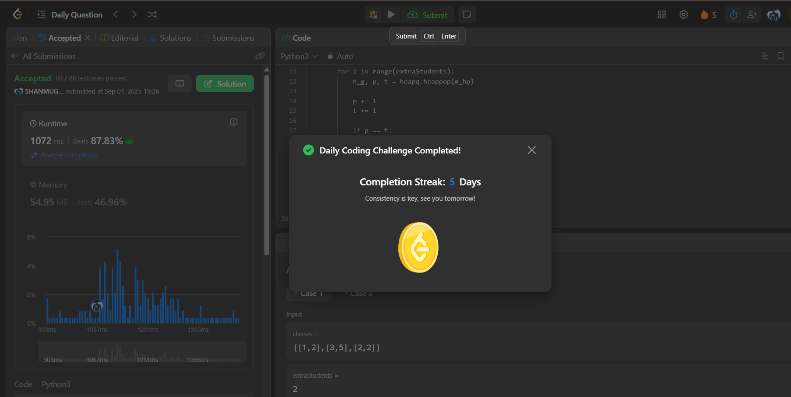

# Day 5 - Maximum Average Pass Ratio

**Problem Link:** [LeetCode 1792 - Maximum Average Pass Ratio](https://leetcode.com/problems/maximum-average-pass-ratio/)  
**Difficulty:** Medium

---

## 💡 Approach
We solve this using a **greedy algorithm** with a **max-heap (priority queue)**.

- The key insight is to always assign an extra student to the class that yields the **largest marginal gain** in the pass ratio.
- The gain for a class is calculated as:

$$
\Delta = \frac{pass+1}{total+1} - \frac{pass}{total}
$$

- At each step, pick the class with the maximum Δ, update its values, and push it back into the heap.

---

## ⏱️ Complexity
- **Time:** `O(k ⋅ log n)`, where `k` = number of extra students, `n` = number of classes  
- **Space:** `O(n)` for the heap

---

## 📸 Screenshot

