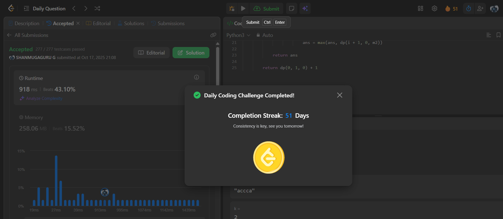

# Day 51 - Maximize the Number of Partitions After Operations

**Problem Link**: [LeetCode 3003 - Maximize the Number of Partitions After Operations](https://leetcode.com/problems/maximize-the-number-of-partitions-after-operations/)  
**Difficulty**: Hard

## 💡 Approach

We solve this using dynamic programming with bit manipulation to maximize partitions where each partition has at most `k` distinct characters.

- Convert each character in string `s` to a bitmask `CHAR[i] = 1 << (ord(c) - ord('a'))` representing its position in the alphabet.
- Define a memoized DP function `dp(i, opt, m1)` where:
  - `i`: current position in the string
  - `opt`: whether we can perform an operation (replace any character with any other)
  - `m1`: bitmask of characters in the current partition
- Base case: If `i == len(CHAR)`, return 0 (end of string).
- For each position `i`:
  - **Continue current partition**: Compute `m2 = m1 | CHAR[i]`. If the bit count ≤ `k`, continue with `dp(i+1, opt, m2)`.
  - **Start new partition**: If `m2.bit_count() > k`, start new partition with `1 + dp(i+1, opt, CHAR[i])`.
  - **Use operation** (if `opt == True`): Try replacing the current character with any of 26 letters, updating the mask and setting `opt = False`.
- Return `dp(0, 1, 0) + 1` (initial call with one operation available, plus 1 for the first partition).

## ⏱️ Complexity

- **Time**: O(n * 2^26 * 26) - Where n is string length. DP states are O(n * 2 * 2^26), and each state tries up to 26 operations.
- **Space**: O(n * 2^26) - For memoization cache with bitmask states.

## 📸 Screenshot
