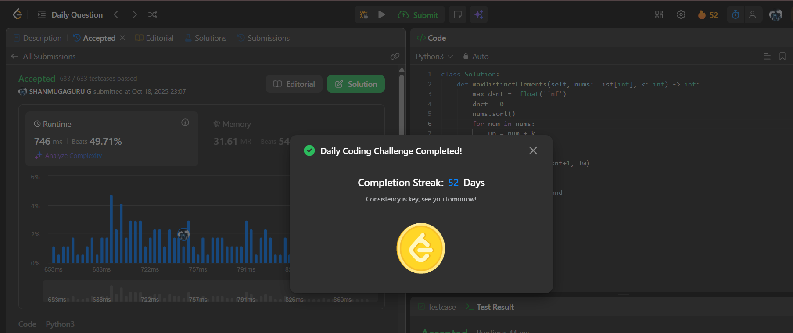

# Day 52 - Maximum Number of Distinct Elements After Operations

**Problem Link**: [LeetCode 3397 - Maximum Number of Distinct Elements After Operations](https://leetcode.com/problems/maximum-number-of-distinct-elements-after-operations/)  
**Difficulty**: Medium

## 💡 Approach

We solve this using a greedy approach with sorting to maximize the number of distinct elements after modifying numbers within a range.

- Sort the input array `nums` in ascending order.
- Initialize `max_dsnt` to track the largest distinct value used and `dnct` to count distinct elements.
- For each number `num` in `nums`:
  - Calculate the valid range for the number after modification: `[num - k, num + k]`.
  - Choose a candidate value as `max(max_dsnt + 1, num - k)` to ensure distinctness and stay within bounds.
  - If the candidate is within `[num - k, num + k]`, update `max_dsnt` to the candidate and increment `dnct`.
- Return `dnct`, the count of distinct elements achievable.

## ⏱️ Complexity

- **Time**: O(n log n) - Sorting takes O(n log n), and the single pass through the array is O(n), where n is the length of `nums`.
- **Space**: O(1) - Only constant extra space is used (excluding input storage).

## 📸 Screenshot
