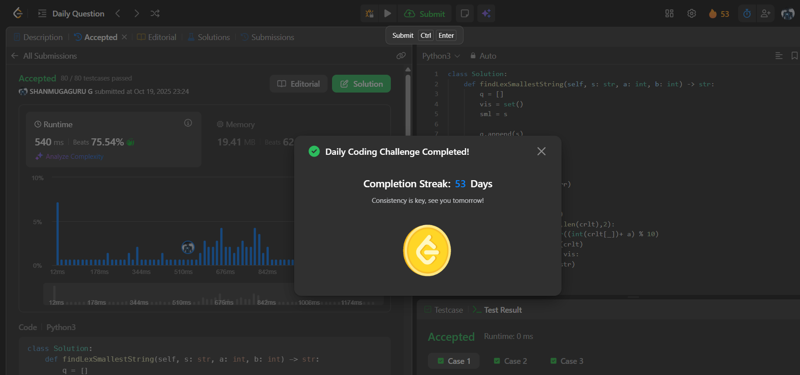

# Day 53 - Lexicographically Smallest String After Applying Operations

**Problem Link**: [LeetCode 1625 - Lexicographically Smallest String After Applying Operations](https://leetcode.com/problems/lexicographically-smallest-string-after-applying-operations/)  
**Difficulty**: Medium

## 💡 Approach

We solve this using BFS to explore all possible strings after applying add and rotate operations, finding the lexicographically smallest.

- Initialize a queue `q` with the input string `s` and a set `vis` to track visited strings.
- Initialize `sml` as the smallest string seen, starting with `s`.
- While the queue is not empty:
  - Pop the current string `curr` from the queue.
  - Update `sml` to the lexicographically smaller of `sml` and `curr`.
  - **Add Operation**: Convert `curr` to a list, add `a` to digits at odd indices (1-based) modulo 10, and form a new string `addstr`. If unseen, add to `q` and `vis`.
  - **Rotate Operation**: Rotate `curr` left by `b` characters to form `rotstr`. If unseen, add to `q` and `vis`.
- Return `sml`, the lexicographically smallest string found.

## ⏱️ Complexity

- **Time**: O(n * 10^(n/2)) - Where n is the length of `s`. The number of unique strings is bounded by the number of distinct digit combinations at odd positions, and BFS explores each valid state.
- **Space**: O(n * 10^(n/2)) - For the queue and visited set storing unique strings.

## 📸 Screenshot
