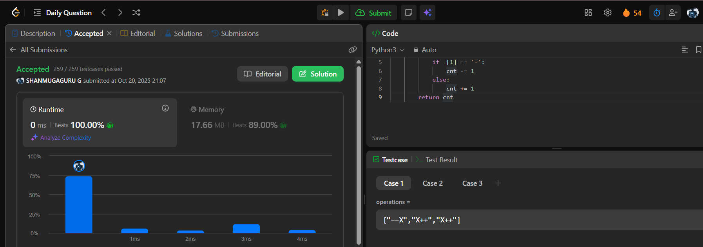

# Day 54 - Final Value of Variable After Performing Operations

**Problem Link**: [LeetCode 2011 - Final Value of Variable After Performing Operations](https://leetcode.com/problems/final-value-of-variable-after-performing-operations/)  
**Difficulty**: Easy

## 💡 Approach

We solve this by iterating through the operations and incrementing or decrementing a counter based on the operation type.

- Initialize a counter `cnt` to 0.
- For each operation in `operations`:
  - Check the second character (index 1) of the operation string:
    - If it is '-', decrement `cnt` by 1.
    - If it is '+', increment `cnt` by 1.
- Return `cnt` as the final value after all operations.

## ⏱️ Complexity

- **Time**: O(n) - Where n is the length of `operations`, as we process each operation once.
- **Space**: O(1) - Only a single counter variable is used.

## 📸 Screenshot
