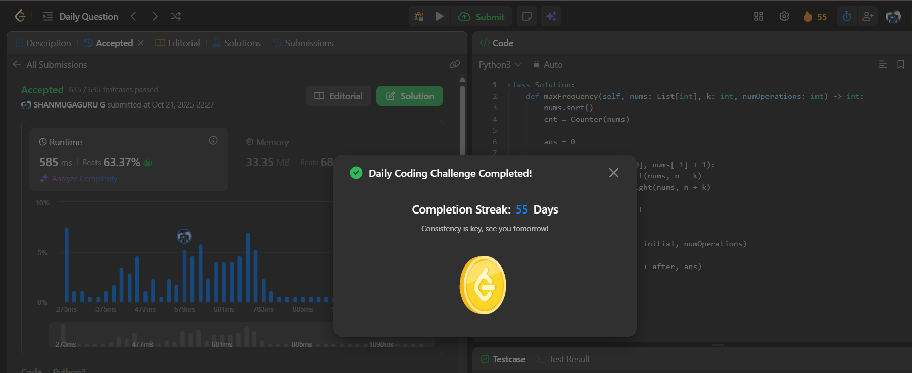

# Day 55 - Maximum Frequency of an Element After Performing Operations I

**Problem Link**: [LeetCode 3346 - Maximum Frequency of an Element After Performing Operations I](https://leetcode.com/problems/maximum-frequency-of-an-element-after-performing-operations-i/)  
**Difficulty**: Medium

## 💡 Approach

We solve this using sorting and binary search to maximize the frequency of an element after modifying values within a range.

- Sort the input array `nums` in ascending order.
- Use a `Counter` to count the frequency of each element in `nums`.
- For each possible target value `n` in the range `[min(nums), max(nums)]`:
  - Use binary search (`bisect_left` and `bisect_right`) to find the range of indices `[n-k, n+k]`.
  - Calculate the window size `win` as the number of elements within this range (`right - left`).
  - Get the initial frequency `initial` of the target value `n` from the `Counter`.
  - Compute the additional frequency `after` as `min(win - initial, numOperations)` (limited by available operations).
  - Update the maximum frequency `ans` with `initial + after`.
- Return `ans`, the maximum frequency achievable for any element.

## ⏱️ Complexity

- **Time**: O(n log n + r log n) - Sorting takes O(n log n), and for each value in the range `r = max(nums) - min(nums)`, binary search takes O(log n).
- **Space**: O(n) - For the sorted array and `Counter`.

## 📸 Screenshot
