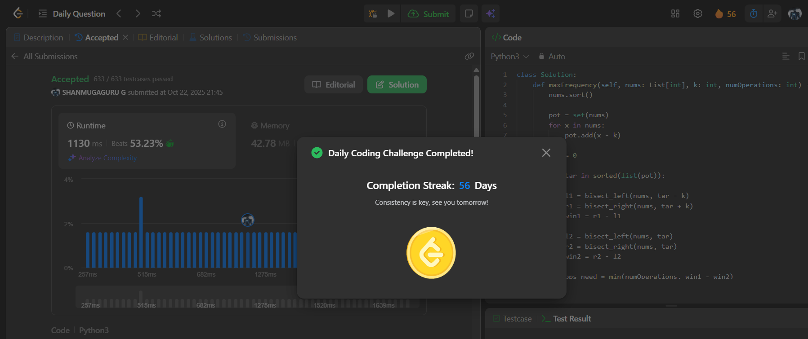

# Day 56 - Maximum Frequency of an Element After Performing Operations II

**Problem Link**: [LeetCode 3347 - Maximum Frequency of an Element After Performing Operations II](https://leetcode.com/problems/maximum-frequency-of-an-element-after-performing-operations-ii/)  
**Difficulty**: Medium

## 💡 Approach

We solve this using sorting and binary search to maximize the frequency of an element by modifying values within a range.

- Sort the input array `nums` in ascending order.
- Create a set `pot` containing all numbers from `nums` and their values minus `k` to consider possible target values after operations.
- For each target value `tar` in the sorted `pot`:
  - Use binary search (`bisect_left` and `bisect_right`) to find:
    - `win1`: Number of elements in `[tar - k, tar + k]` (potential frequency after operations).
    - `win2`: Number of elements equal to `tar` (initial frequency).
  - Calculate `ops_need` as `min(numOperations, win1 - win2)` to determine how many operations can be used.
  - Compute the current frequency as `win2 + ops_need`.
  - Update `ans` with the maximum frequency seen.
- Return `ans`, the maximum frequency achievable for any target value.

## ⏱️ Complexity

- **Time**: O(n log n + p log n) - Sorting `nums` takes O(n log n), and for each of O(p) potential targets (p ≤ 2n), binary search takes O(log n).
- **Space**: O(n) - For the sorted array and potential target set.

## 📸 Screenshot
