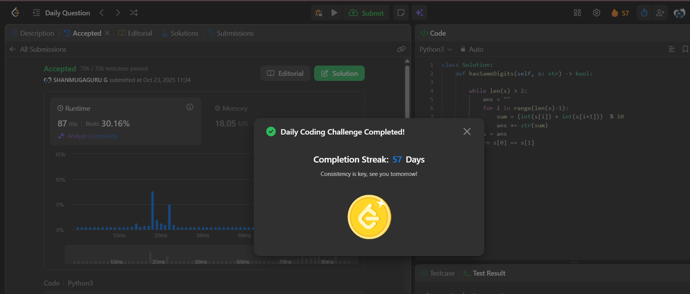

# Day 57 - Check If Digits Are Equal in String After Operations I

**Problem Link**: [LeetCode 3461 - Check If Digits Are Equal in String After Operations I](https://leetcode.com/problems/check-if-digits-are-equal-in-string-after-operations-i/)  
**Difficulty**: Medium

## 💡 Approach

We solve this by iteratively reducing the string by summing adjacent digits modulo 10 until a two-digit string remains, then checking if the digits are equal.

- While the string length is greater than 2:
  - Create a new string `ans` by iterating through `s` up to the second-to-last character.
  - For each pair of adjacent digits, compute their sum modulo 10 and append to `ans`.
  - Update `s` to `ans` for the next iteration.
- After the loop, check if the first and second digits of the resulting two-digit string `s` are equal.
- Return `True` if they are equal, `False` otherwise.

## ⏱️ Complexity

- **Time**: O(n log n) - Where n is the length of the string. Each iteration reduces the string length by 1, and there are O(log n) iterations in the worst case.
- **Space**: O(n) - For storing the intermediate string `ans`.

## 📸 Screenshot
