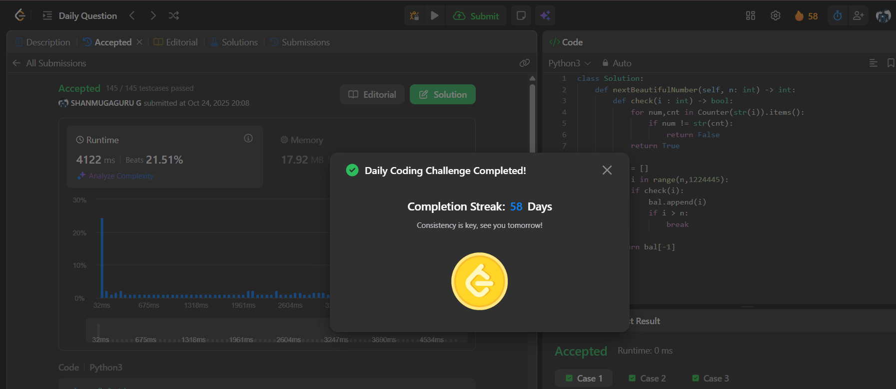

# Day 58 - Next Greater Numerically Balanced Number

**Problem Link**: [LeetCode 2048 - Next Greater Numerically Balanced Number](https://leetcode.com/problems/next-greater-numerically-balanced-number/)  
**Difficulty**: Medium

## 💡 Approach

We solve this by checking numbers greater than `n` to find the next numerically balanced number, where each digit's frequency equals its value.

- Define a helper function `check(i)`:
  - Convert number `i` to a string and use `Counter` to count digit frequencies.
  - For each digit and its count, check if the digit (as a string) equals its count.
  - Return `True` if all digits satisfy this condition, `False` otherwise.
- Iterate from `n` to a reasonable upper limit (e.g., 1,224,445, as larger balanced numbers are sparse).
- For each number, if `check(i)` returns `True`, store it in a list `bal`.
- Stop after finding the first balanced number greater than `n`.
- Return the last number in `bal`, which is the next greater balanced number.

## ⏱️ Complexity

- **Time**: O(m * log m) - Where m is the range from `n` to the next balanced number. Checking each number involves string conversion and Counter operations (O(log m) per number).
- **Space**: O(log m) - For the Counter and string representation of numbers.

## 📸 Screenshot
