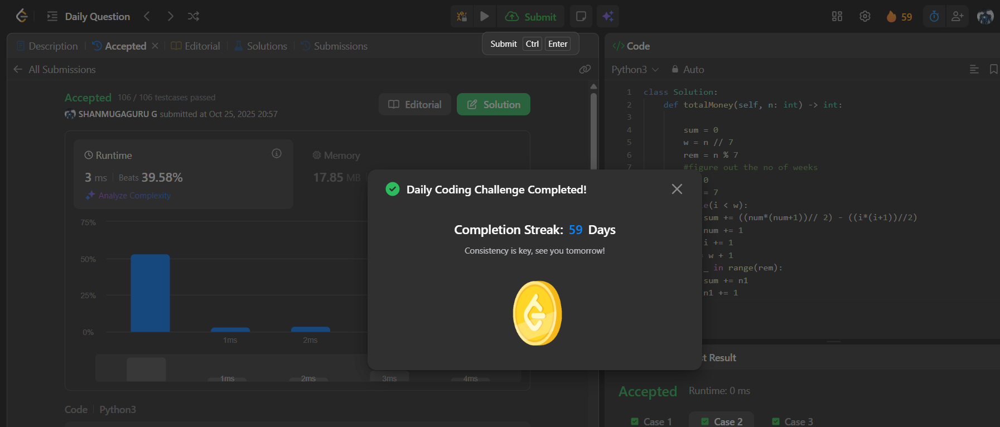

# Day 59 - Calculate Money in Leetcode Bank

**Problem Link**: [LeetCode 1716 - Calculate Money in Leetcode Bank](https://leetcode.com/problems/calculate-money-in-leetcode-bank/)  
**Difficulty**: Easy

## 💡 Approach

We solve this by calculating the total money saved over `n` days, considering weekly patterns and remaining days.

- Initialize `sum` to track total money saved.
- Compute the number of full weeks `w = n // 7` and remaining days `rem = 7 - (n % 7)`.
- For each full week `i` (0 to `w-1`):
  - Calculate the sum of money for the week using the formula for the sum of an arithmetic sequence: `((num * (num + 1)) // 2) - ((i * (i + 1)) // 2)`, where `num = 7 + i` is the last day’s deposit.
  - Increment `i` and `num` for the next week.
- Add the sum for the last partial week using the same formula.
- Subtract the contributions of unused days in the last week by iterating `rem` times, reducing `num` each time.
- Return `sum` as the total money saved.

## ⏱️ Complexity

- **Time**: O(w + rem) - Where `w` is the number of full weeks and `rem` is the remaining days, effectively O(n/7).
- **Space**: O(1) - Only constant extra space is used.

## 📸 Screenshot
