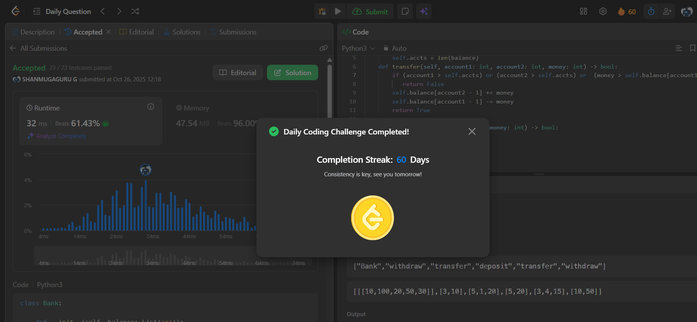

# Day 60 - Simple Bank System

**Problem Link**: [LeetCode 2043 - Simple Bank System](https://leetcode.com/problems/simple-bank-system/)  
**Difficulty**: Medium

## 💡 Approach

We solve this by implementing a simple bank system with methods for transfer, deposit, and withdrawal using an array to track balances.

- **Initialization**: Store the initial `balance` array and the number of accounts `accts = len(balance)`.
- **transfer**: 
  - Check if `account1` or `account2` exceeds `accts` or if `money` exceeds `balance[account1 - 1]`. If so, return `False`.
  - Subtract `money` from `balance[account1 - 1]` and add to `balance[account2 - 1]`.
  - Return `True`.
- **deposit**: 
  - Check if `account` exceeds `accts`. If so, return `False`.
  - Add `money` to `balance[account - 1]`.
  - Return `True`.
- **withdraw**: 
  - Check if `account` exceeds `accts` or if `money` exceeds `balance[account - 1]`. If so, return `False`.
  - Subtract `money` from `balance[account - 1]`.
  - Return `True`.

## ⏱️ Complexity

- **Time**: O(1) - Each operation (transfer, deposit, withdraw) performs constant-time checks and updates.
- **Space**: O(n) - Where n is the number of accounts for storing the `balance` array.

## 📸 Screenshot
