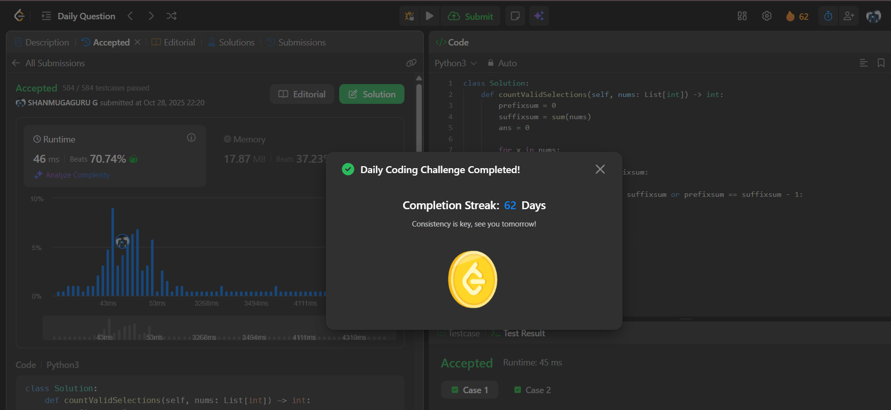

# Day 62 - Make Array Elements Equal to Zero

**Problem Link**: [LeetCode 3354 - Make Array Elements Equal to Zero](https://leetcode.com/problems/make-array-elements-equal-to-zero/)  
**Difficulty**: Medium

## Approach

We solve this by using prefix and suffix sums to efficiently check conditions when an element is zero.

- Initialize:
  - `prefixsum = 0` (sum of elements to the left of current index)
  - `suffixsum = sum(nums)` (sum of elements from current index onward)
  - `ans = 0` to count valid selections
- Iterate through each element `x` in `nums`:
  - If `x == 0`:
    - Check if `prefixsum == suffixsum` → both sides balanced → add **2** to `ans`
    - Else if `prefixsum - 1 == suffixsum` or `prefixsum == suffixsum - 1` → one operation can balance → add **1** to `ans`
  - Update:
    - `prefixsum += x`
    - `suffixsum -= x`
- Return `ans`, the total number of valid ways to select operations.

## Complexity

- **Time**: O(n) — single pass through the array
- **Space**: O(1) — only a few variables used

## Screenshot
