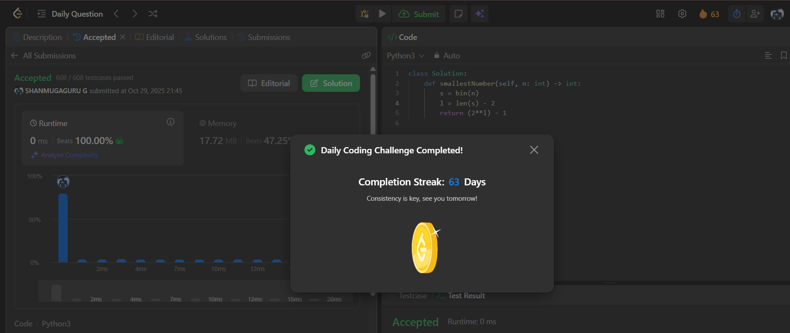

# Day 63 - Smallest Number With All Set Bits

**Problem Link**: [LeetCode 3370 - Smallest Number With All Set Bits](https://leetcode.com/problems/smallest-number-with-all-set-bits/)  
**Difficulty**: Easy

## Approach

We solve this by finding the number of bits required to represent `n` and constructing the smallest number with all bits set up to that length.

- Convert `n` to its binary representation using `bin(n)`.
- The length of the binary string (excluding `'0b'`) is `l = len(s) - 2`.
- The smallest number with `l` bits all set to `1` is `2^l - 1`.
- Return `(2**l) - 1`.

> Example:  
> `n = 5` → `bin(5) = '0b101'` → `l = 3` → `2^3 - 1 = 7` (which is `111` in binary)

## Complexity

- **Time**: O(log n) — due to binary conversion
- **Space**: O(1) — only a few variables used

## Screenshot
