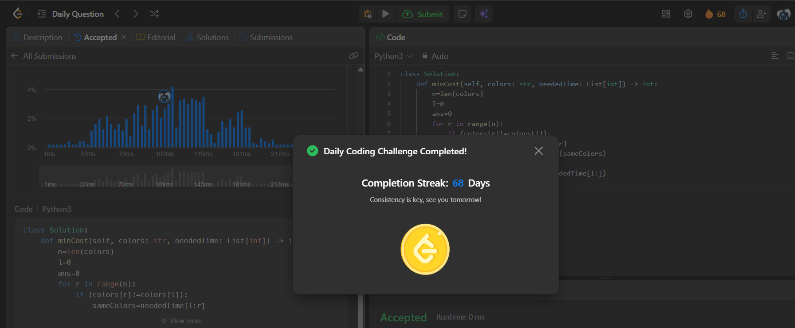

# Day 68 - Minimum Time to Make Rope Colorful

**Problem Link**: [LeetCode 1578 - Minimum Time to Make Rope Colorful](https://leetcode.com/problems/minimum-time-to-make-rope-colorful/)  
**Difficulty**: Medium

## Approach

We solve this using a **sliding window** technique to group consecutive balloons of the same color and remove all but the most expensive one in each group.

- Initialize:
  - `l = 0` (left pointer)
  - `ans = 0` (total cost)
- Iterate `r` from `0` to `n-1`:
  - When `colors[r] != colors[l]`, we end a group of same-colored balloons.
  - For the group from `l` to `r-1`:
    - Sum of `neededTime[l:r]` → total cost to remove all.
    - Subtract `max(neededTime[l:r])` → keep the most expensive one.
    - Add this cost to `ans`.
  - Update `l = r` to start a new group.
- After the loop, process the **last group** from `l` to end.
- Return `ans`.

> **Key Insight**: In any group of consecutive same-colored balloons, keep the one with max `neededTime`, remove the rest.

## Complexity

- **Time**: **O(n)** — single pass through the string
- **Space**: **O(1)** — only using a few variables

## Screenshot
