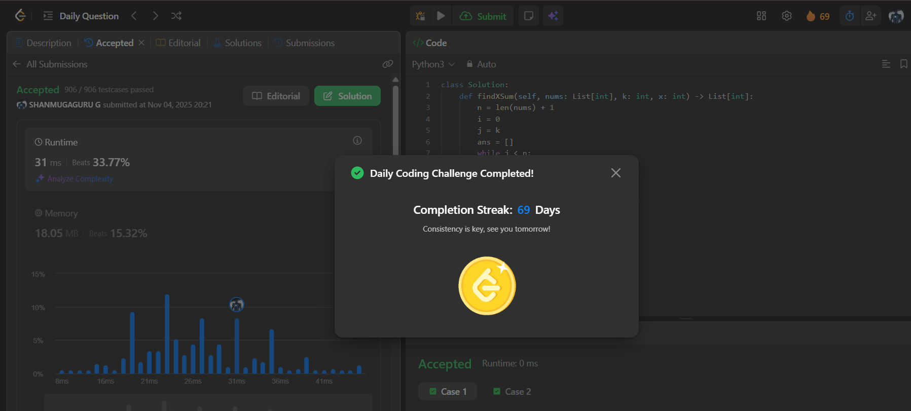

# Day 69 - Find X-Sum of All K-Long Subarrays I

**Problem Link**: [LeetCode 3318 - Find X-Sum of All K-Long Subarrays I](https://leetcode.com/problems/find-x-sum-of-all-k-long-subarrays-i/)  
**Difficulty**: Medium

## Approach

We solve this using a **sliding window** of size `k` and **frequency counting** to compute the **X-Sum** for each subarray.

- Use two pointers `i` and `j` to maintain a window of size `k`.
- For each window `nums[i:j]`:
  - Use `Counter` to count frequency of each number.
  - Sort the `(number, frequency)` pairs by:
    - **Frequency** (descending)
    - **Number** (descending) — tiebreaker
  - Take the **first `x`** elements and compute:  
    `X-Sum = Σ(number × frequency)` for these `x` elements.
  - Append result to `ans`.
- Slide the window: `i += 1`, `j += 1`.
- Return `ans`.

> **X-Sum** = sum of (value × frequency) of the **top `x`** most frequent elements in the subarray.

## Complexity

- **Time**: **O(n × k log k)** — for each of `n-k+1` windows, sorting `k` elements takes `O(k log k)`
- **Space**: **O(k)** — for the counter and sorted list

## Screenshot
