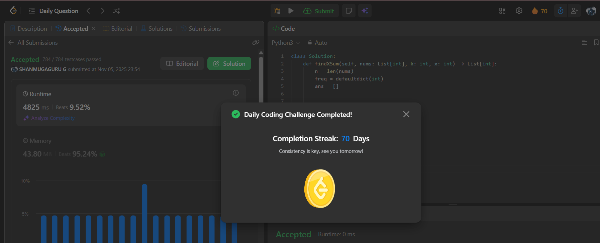

# Day 70 - Find X-Sum of All K-Long Subarrays II

**Problem Link**: [LeetCode 3321 - Find X-Sum of All K-Long Subarrays II](https://leetcode.com/problems/find-x-sum-of-all-k-long-subarrays-ii/)  
**Difficulty**: Hard

## Approach

We solve this using **two `SortedList`s** to maintain the **top `x` most frequent elements** and the rest, enabling **O(log k)** updates and **O(1)** X-Sum access.

- Use:
  - `topX`: `SortedList` of **top `x`** elements (by frequency, then value).
  - `rest`: `SortedList` of remaining elements.
  - `freq`: `defaultdict(int)` to track frequency.
  - `sumTop`: running sum of `value × frequency` for elements in `topX`.
- **Key function**: `(freq[val], val)` → sort by frequency (desc), then value (desc).
- **Rebalance** function:
  - Ensures `topX` has exactly `min(x, len(freq))` elements.
  - Moves elements between `topX` and `rest` if a better candidate exists.
  - Updates `sumTop` during swaps.
- **Sliding window**:
  - Add `nums[i]` → update `freq`, remove from old list, add to `rest`, rebalance.
  - After `i >= k`, remove `nums[i-k]` → update `freq`, remove from list, rebalance.
  - After `i >= k-1`, append `sumTop` to `ans`.

## Complexity

- **Time**: **O(n log k)** — each addition/removal is O(log k)
- **Space**: **O(k)** — for `topX`, `rest`, and `freq`

## Screenshot
