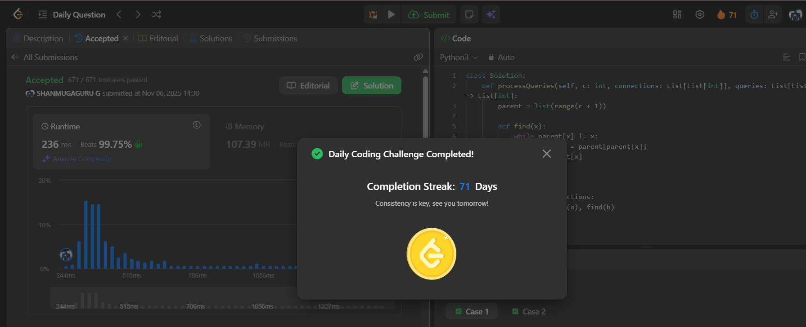

# Day 71 - Power Grid Maintenance

**Problem Link**: [LeetCode 3607 - Power Grid Maintenance](https://leetcode.com/problems/power-grid-maintenance/)  
**Difficulty**: Hard

## Approach

We solve this using **Union-Find (DSU) with path compression** + **linked list per component** to handle offline queries efficiently.

### Key Ideas:
- **Union-Find**: Merge connected cities initially using all `connections`.
- **Per Component Linked List**: For each component (root), maintain a singly linked list of cities using `next_node` and track the minimum (head) with `comp_min`.
- **Offline Array**: `offline[x] = True` when a city goes offline.
- **Query Type 1 (Find smallest online city)**:
  - If `x` is online → return `x`.
  - If offline → return the current `comp_min[root]` (smallest online in its component).
- **Query Type 2 (Take city offline)**:
  - If already offline → do nothing.
  - Mark `offline[x] = True`.
  - If `x` was the `comp_min` (head), advance the head:
    - Skip all subsequent offline cities using `next_node`.
    - Update `comp_min[root]` to the next online city (or 0 if none).

### Why it works:
- DSU groups connected cities.
- Linked list allows **O(1) amortized** skipping of offline cities when advancing the head.
- No need to rebuild lists — just lazy skip.

## Complexity

- **Time**: **O(c + q + α(c))** ≈ **O(c + q)** (α = inverse Ackermann, nearly constant)
- **Space**: **O(c)**

## Screenshot
