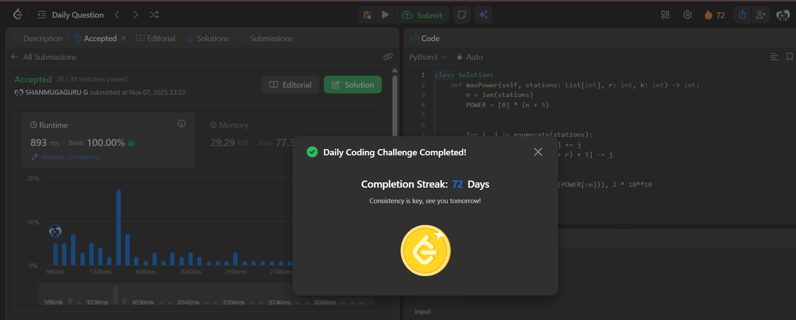

# Day 72 - Maximize the Minimum Powered City

**Problem Link**: [LeetCode 2528 - Maximize the Minimum Powered City](https://leetcode.com/problems/maximize-the-minimum-powered-city/)  
**Difficulty**: Hard

## Approach

We solve this using **difference array + binary search** to maximize the **minimum power** in any city after placing `k` power stations.

### Key Ideas:
1. **Precompute initial power** using **difference array**:
   - Each station at `i` contributes `stations[i]` to range `[i-r, i+r]`.
   - Use `POWER` array: `POWER[i-r] += s`, `POWER[i+r+1] -= s`.
   - Use `accumulate(POWER)` to get power at each city.

2. **Binary search on answer** `mid`:
   - `lo` = minimum current power (after accumulate)
   - `hi` = very large (e.g., `2e10`)

3. **Check function**:
   - Simulate placing extra power to make every city ≥ `mid`.
   - Use **difference array again** to apply extra power at index `i` affecting `[i, i+2*r]`.
   - Track `cur` power and `cnt` used.
   - If `cur < mid`, add `need = mid - cur` at current index.
   - Apply this boost using difference array.
   - If `cnt > k` → impossible.

4. **Return highest `mid`** that passes `check`.

## Complexity

- **Time**: **O(n log P)** — binary search over power range, each check is O(n)
- **Space**: **O(n)** — for difference arrays

## Screenshot
