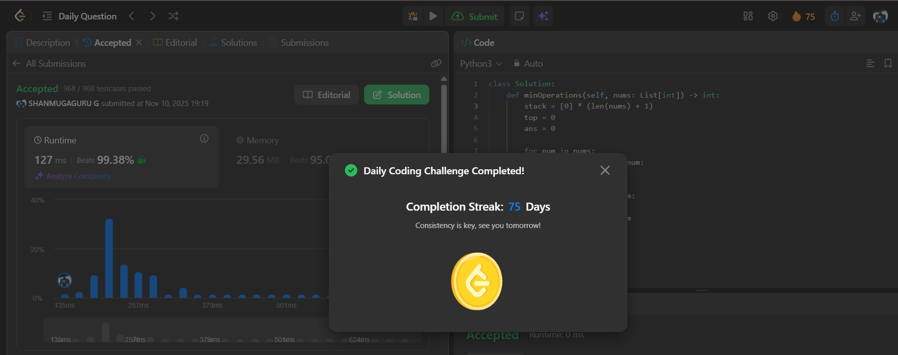

# Day 75 - Minimum Operations to Convert All Elements to Zero

**Problem Link**: [LeetCode 3542 - Minimum Operations to Convert All Elements to Zero](https://leetcode.com/problems/minimum-operations-to-convert-all-elements-to-zero/)  
**Difficulty**: Medium

## Approach

We solve this using a **stack-based greedy simulation** to minimize the number of operations needed to reduce all elements to zero.

### Key Insight:
> **Each number in the array must be "removed" using a sequence of subtractions.**  
> We can model this as building **non-increasing** sequences where each step removes the top of the stack.

### Algorithm:
- Use a **monotonic increasing stack** to track numbers that are still "active".
- For each `num` in `nums`:
  - While the **top of the stack is greater than `num`**:
    - Pop it → this represents **one operation** (subtracting `num` from a larger value).
    - Increment `ans`.
  - If the **top is not equal to `num`**, push `num` onto the stack.
- After processing all numbers:
  - The **remaining stack elements** must be reduced to zero → each requires **1 operation**.
  - Add `top` (stack size) to `ans`.

> **Why monotonic increasing?**  
> We always want to subtract the **smallest possible** value to reduce larger ones efficiently.

### Example: `nums = [3, 1, 2]`
| Step | Stack | `ans` | Action |
|------|-------|-------|--------|
| 3    | [3]   | 0     | Push 3 |
| 1    | []    | 2     | Pop 3 twice (3→2→1) |
| 1    | [1]   | 2     | Push 1 |
| 2    | [1]   | 3     | Pop 1 (2→1) |
| 2    | [2]   | 3     | Push 2 |
| End  | [2]   | 4     | +1 for remaining 2 |

→ **Total: 4 operations**

## Complexity

- **Time**: **O(n)** — each element is pushed and popped at most once
- **Space**: **O(n)** — for the stack

## Screenshot
