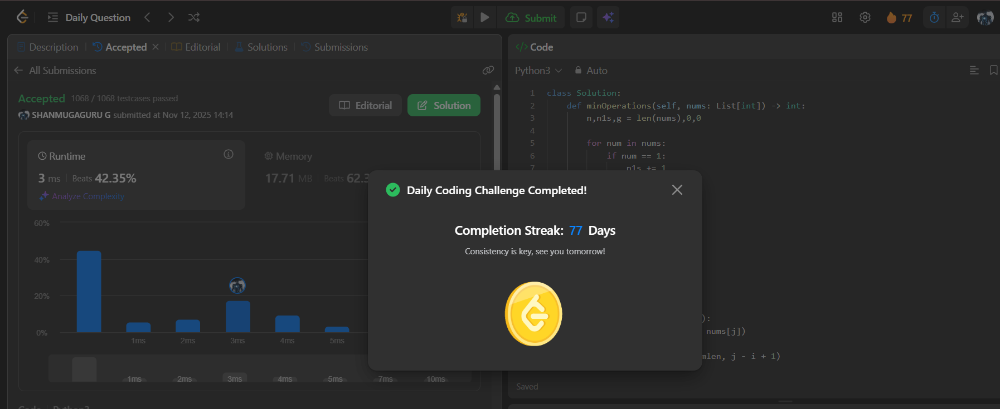

# Day 77 - Minimum Number of Operations to Make All Array Elements Equal to 1

**Problem Link**: [LeetCode 2654 - Minimum Number of Operations to Make All Array Elements Equal to 1](https://leetcode.com/problems/minimum-number-of-operations-to-make-all-array-elements-equal-to-1/)  
**Difficulty**: Medium

## Approach

We solve this by analyzing **three cases** and returning the **minimum operations** required.

### Step-by-Step:

1. **Count existing `1`s**:
   - Each `1` saves **one operation**.
   - If any `1` exists → answer is `n - count_1s`.

2. **Check if GCD of entire array > 1**:
   - If `gcd(nums) > 1` → impossible to make all `1` → return `-1`.

3. **Find smallest subarray with GCD = 1**:
   - Let `mlen` = length of shortest subarray where `gcd(subarray) == 1`.
   - We can turn this subarray into `1` in `mlen - 1` operations.
   - Then, merge it with the rest of the array → `n - 1` more operations.
   - Total: `mlen + n - 2`.

4. **Return the minimum** of the two valid cases.

### Key Insight:
> The **shortest subarray with GCD 1** gives the **fastest way** to introduce a `1`.

## Complexity

- **Time**: **O(n² log max(nums))** — nested loop + GCD
- **Space**: **O(1)**

## Screenshot
